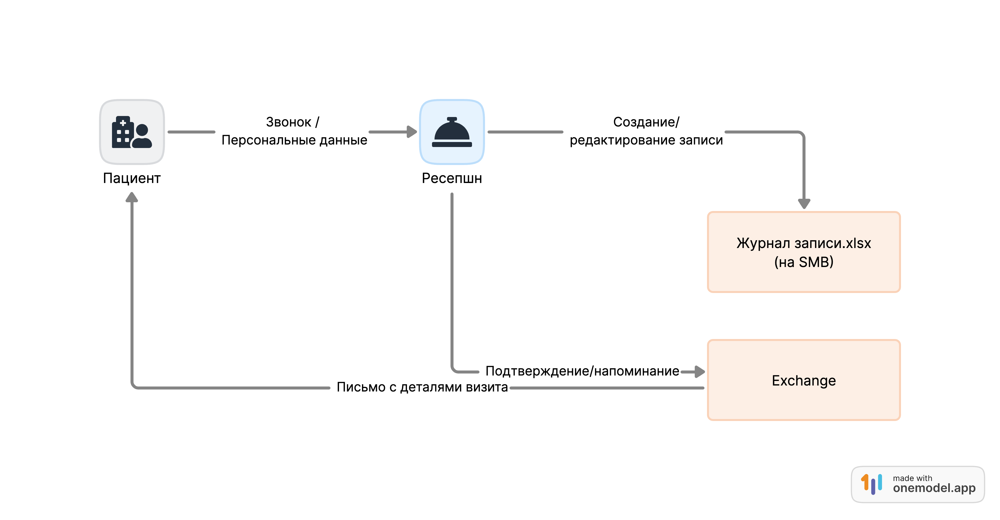
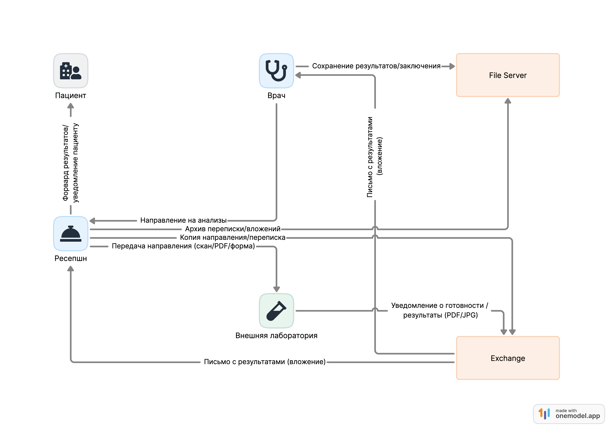
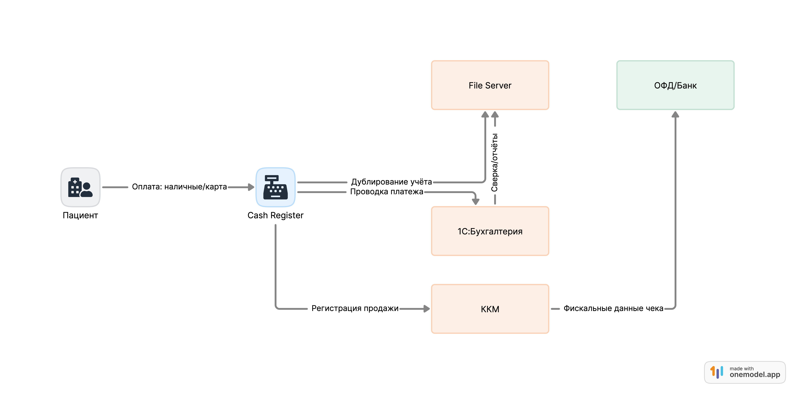
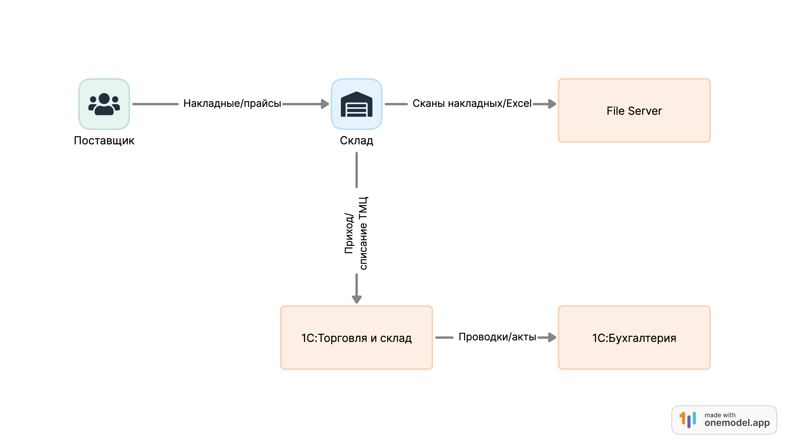
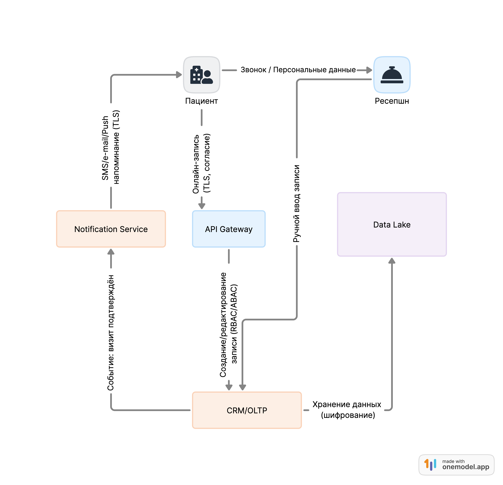
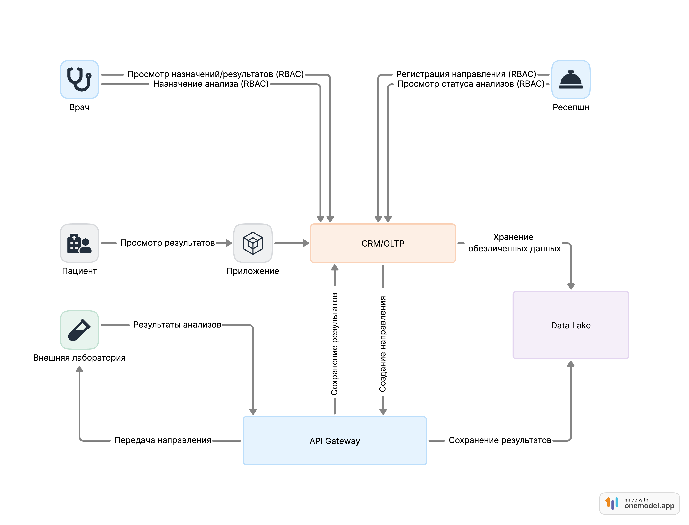
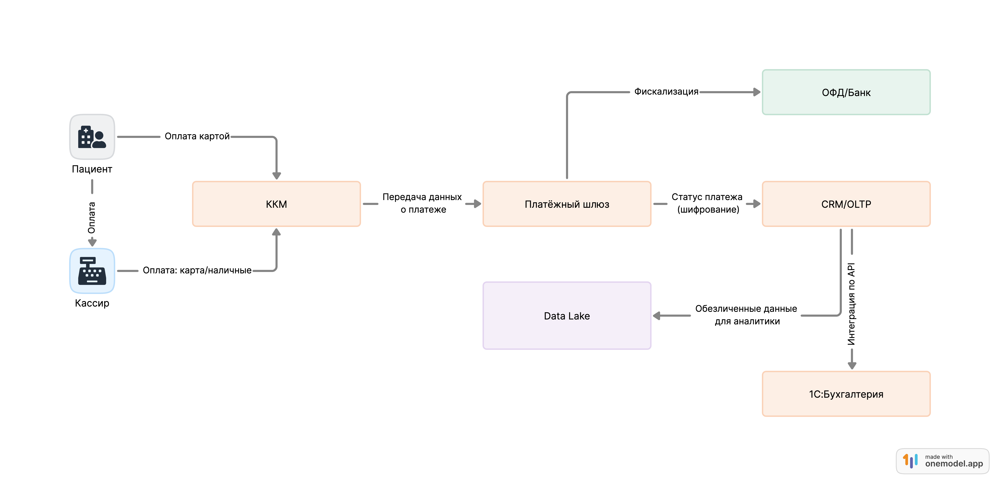
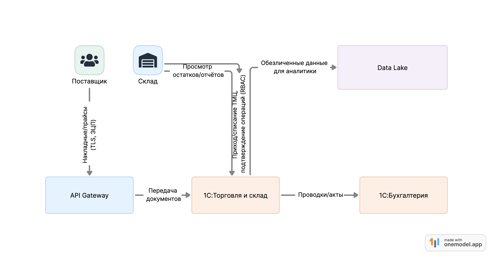

# Анализ безопасности системы

## 1. Потоки данных (DFD As-Is)

Анализ текущих процессов показал, что в системе циркулируют конфиденциальные данные пациентов (ФИО, контакты, результаты анализов, данные платежей), а также коммерческая информация (накладные, цены, бухгалтерские данные).  
Ниже приведены диаграммы потоков данных (As-Is):

- **DFD-01 Запись пациента (As-Is)**  
  

- **DFD-02 Учёт анализов (As-Is)**  
  

- **DFD-03 Оплата услуг (As-Is)**  
  

- **DFD-04 Учёт ТМЦ (As-Is)**  
  

---

## 2. Аудит мер по обеспечению безопасности данных

См. [Список проблемных зон](problems.md)

### Проблемные зоны
1. **Передача данных по незащищённым каналам** — SMB-шары, почта без TLS.
2. **Отсутствие контроля доступа (RBAC/ABAC)** — Excel/файлы доступны широкому кругу сотрудников.
3. **Хранение данных без шифрования** — персональные и коммерческие данные в открытом виде.
4. **Дублирование и отсутствие единой системы учёта** — файлы Excel, ручные журналы.
5. **Отсутствие централизованного механизма согласий пациента**.
6. **Риск утечки при пересылке анализов и сканов по почте**.
7. **Нет полноценного журнала аудита событий и операций**.
8. **Платёжные операции частично не соответствуют требованиям PCI DSS**.

---

## 3. Что можно улучшить

- Внедрить принципы **Privacy by Design**: минимизация собираемых данных, шифрование при хранении и передаче, разграничение доступа.
- Централизовать хранение данных в **CRM/OLTP** с подключением **Data Lake** для аналитики.
- Использовать **RBAC/ABAC** для разграничения прав сотрудников.
- Перейти от почтовых вложений и SMB-шар к **защищённым API (TLS, ЭЦП)**.
- Организовать **хранение согласий пациентов** в отдельном модуле Consent Management.
- В платежном контуре — внедрить требования **PCI DSS**, антифрод-контроль.
- Для доступа пациентов — добавить **MFA** в мобильное приложение/портал.
- Ввести **централизованный журнал аудита** (audit log).

---

## 4. Тэгирование данных и Data Lineage

Для реализации отслеживания движения данных (Data Lineage) и классификации:
- Внедрить инструмент **Apache Atlas**.
- Использовать **Hadoop**/Data Lake для хранения и анализа.
- Обязательная **обезличка (masking/anonymization)** при выгрузке данных в Data Lake.

Пример классификации:
- **Персональные данные пациента** → шифрование (AES-256), контроль доступа.
- **Результаты анализов** → шифрование + псевдонимизация.
- **Финансовые операции** → шифрование, журналирование, PCI DSS.
- **Накладные и цены** → ЭЦП, контроль целостности.

---

## 5. Потоки данных (DFD To-Be)

Обновлённые схемы потоков данных после внедрения мер защиты и централизации:

- **DFD-01 Запись пациента (To-Be)**  
  

- **DFD-02 Учёт анализов (To-Be)**  
  

- **DFD-03 Оплата услуг (To-Be)**  
  

- **DFD-04 Учёт ТМЦ (To-Be)**  
  
