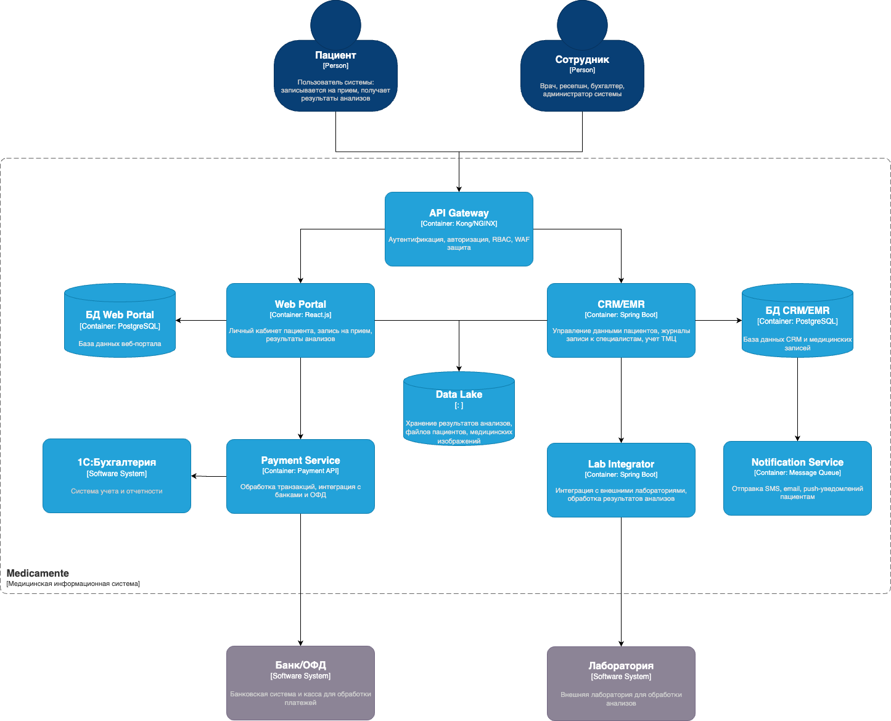

# Task 2. Проектирование решения (Privacy by Design)

## Цель
Целевая архитектура учитывает требования Privacy by Design и обеспечивает защиту медицинских и персональных данных пациентов на всех уровнях: от сбора и хранения до аналитики и интеграций с внешними системами.

## Архитектура (C4 — Context)
Диаграмма целевого состояния:

## Компоненты и роли (в соответствии со схемой)

- API Gateway (Kong/NGINX)
    - TLS для всех внешних соединений, WAF.
    - Централизованная аутентификация и авторизация (RBAC/ABAC) на входе.
    - Проксирование к Web Portal, CRM/EMR, Payment, Lab Integrator, Notification.

- Web Portal (React.js) + БД портала (PostgreSQL)
    - Личный кабинет пациента: запись, просмотр результатов, уведомления.
    - Доступ только по TLS; поддержка MFA как организационная мера.
    - Хранение минимально необходимого профиля; шифрование БД.

- CRM/EMR (Spring Boot) + БД CRM/EMR (PostgreSQL)
    - Управление медицинскими данными, расписанием, ТМЦ.
    - Ролевой доступ сотрудников; аудит операций чтения/изменения.
    - Применение согласий пациента при обработке и выдаче данных.
    - Шифрование БД; журналирование бизнес-событий для последующего анализа.
    - Поддержка проверки целостности и юридической значимости документов (ЭЦП) для результатов/накладных, где требуется.

- Lab Integrator (Spring Boot)
    - Безопасный обмен направлениями и результатами анализов с лабораториями.
    - TLS на транспортном уровне; проверка целостности/подлинности сообщений.
    - Передача в CRM/EMR только необходимых атрибутов (data minimization).

- Payment Service (Payment API)
    - Интеграция с банками/ОФД; транзакции по защищенным каналам.
    - Хранение токенов вместо данных карт; аудит платежных событий.
    - Базовые антифрод-проверки как часть бизнес-логики.
    - Соответствие принципам PCI DSS: отсутствие хранения PAN в системе, сегментация платежного контура, ограничение доступа по ролям.

- Notification Service (Message Queue)
    - Отправка SMS/email/push без передачи чувствительных медицинских данных в контенте.
    - Шаблоны уведомлений, соблюдающие согласия пациента и минимизацию данных.
    - Использование защищенных каналов (TLS/STARTTLS, доменные подписи как организационная мера).

- Data Lake
    - Аналитическое хранилище для обезличенных данных.
    - Слои: сырые (ограниченно и зашифровано), обезличенные (для BI/аналитики).
    - Обезличивание/псевдонимизация выполняется до загрузки в аналитические слои.

- 1С:Бухгалтерия, Банк/ОФД, Лаборатория
    - Взаимодействуют через защищенные интеграции.
    - Передаются только необходимые данные, доступ ограничен по ролям и целям.

## Privacy by Design — как реализовано на схеме

- Data Minimization
    - Портал и интеграторы передают и хранят только необходимые поля.
    - В выгрузки для аналитики попадают обезличенные наборы.

- Шифрование
    - В передаче: TLS для всех внутренних/внешних вызовов.
    - В хранении: шифрование БД портала, CRM/EMR и объектов в Data Lake.

- Контроль доступа (RBAC/ABAC)
    - На входе: API Gateway применяет политики доступа.
    - В сервисах: доменные проверки прав на уровне CRM/EMR и Payment.

- Управление согласиями пациента
    - Согласия фиксируются и проверяются в CRM/EMR и Web Portal.
    - Уведомления и выдача данных учитывают избранные каналы и цели обработки.
    - Централизованный реестр согласий и целей обработки как часть функционала CRM/EMR.

- Аудит и трассируемость
    - Логирование на уровне API Gateway и доменных сервисов.
    - Неизменяемые записи ключевых событий доступа и изменений данных.
    - Каталогизация метаданных и отслеживание происхождения данных (data lineage) для прозрачности аналитики.

- Аналитика с обезличиванием
    - Перед загрузкой в Data Lake применяется анонимизация/псевдонимизация.
    - Доступ к сырым данным ограничен; BI работает с обезличенными слоями.

- Безопасные интеграции
    - Платежи: токенизация, аудит транзакций, соблюдение требований PCI DSS.
    - Лаборатории: защищенный транспорт и проверка целостности.

## Итог
Решение обеспечивает:
- минимизацию собираемых данных и прозрачность их использования;
- централизованный контроль доступа и аудит;
- безопасные каналы обмена с внешними организациями;
- аналитическую работу только с обезличенными данными.