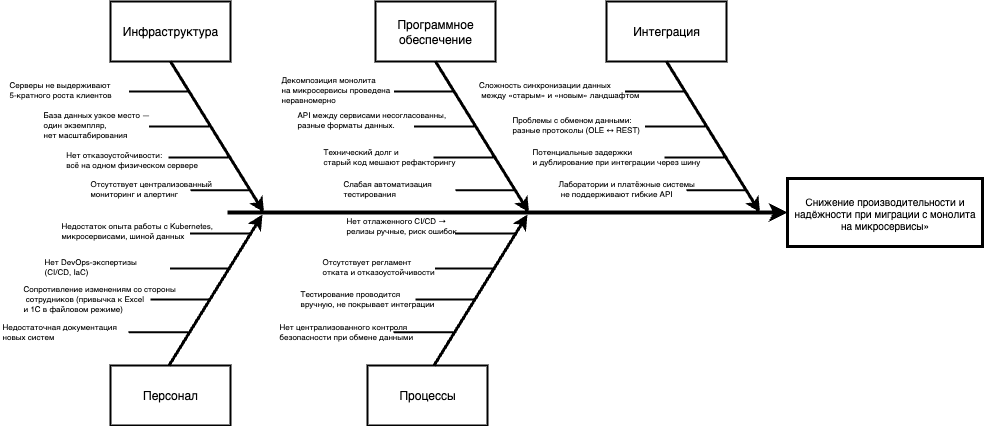

# Task 4 — Оценка узких мест при миграции

## Диаграмма Исикавы

Полная версия: [ishikawa-migration.drawio](./ishikawa-migration.drawio)

## Категории и потенциальные проблемы

- **Инфраструктура**
    - Недостаточная производительность серверов при росте нагрузки.
    - Проблемы с масштабированием БД.
    - Отсутствие мониторинга и алертинга.

- **Программное обеспечение**
    - Ошибки при декомпозиции монолита на сервисы.
    - Несогласованность API между новыми сервисами.
    - Технический долг в легаси-коде.

- **Интеграция**
    - Сложности с синхронизацией данных между старыми и новыми системами.
    - Несовместимость протоколов/форматов.
    - Задержки при работе через шину данных.

- **Персонал**
    - Недостаток опыта у команды в построении микросервисов.
    - Недостаточная документация.
    - Риск сопротивления изменениям.

- **Процессы**
    - Отсутствие CI/CD для новых сервисов.
    - Долгое тестирование и ручные релизы.
    - Отсутствие централизованного контроля безопасности.

## Меры по устранению узких мест

1. Внедрить систему мониторинга и алертинга (Prometheus, Grafana).
2. Использовать управляемые кластеры для масштабируемости (Kubernetes + кластерные БД).
3. Определить стандарты API и документировать (OpenAPI/Swagger).
4. Построить процесс миграции данных поэтапно (dual-write, CDC).
5. Провести обучение команды по микросервисной архитектуре.
6. Внедрить CI/CD pipeline с автоматическим тестированием и безопасностью.

## Приоритетность мер

- **Высокий приоритет**: масштабируемость БД, стандартизация API, CI/CD, мониторинг.
- **Средний приоритет**: обучение команды, документация, миграция данных.
- **Низкий приоритет**: оптимизация ручных процессов, культурные изменения.

## Итог
Потенциальные риски миграции систематизированы по ключевым категориям.  
Рекомендации позволяют снизить вероятность сбоев, повысить надёжность и обеспечить плавный переход на микросервисную архитектуру.
